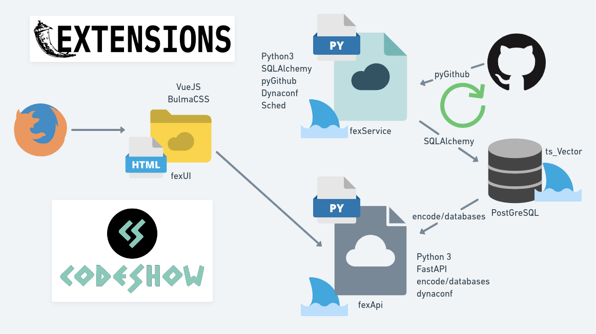
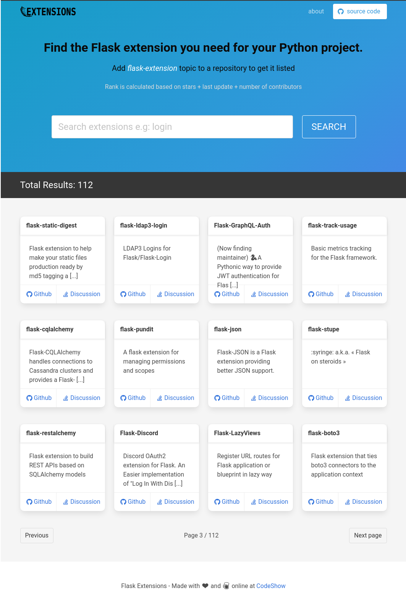
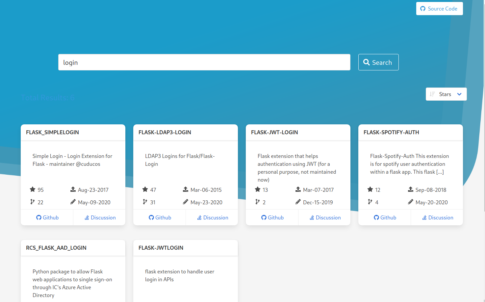

# FlaskExtensions.com

Website http://flaskextensions.com curated collection of Flask Extensions and its resources

## Why?

There are some amazing Flask Extensions spread across github and gitlab repositories but we miss a place to aggregate and follow status of them all.

## How?

This project has been develped during live coding streams at https://twitch.tv/codeshow

## Stack

This project is divided in some services:

- **FEXService**

  Powered by **Python sched** Fetches data from Github API for every repo having `flask-extension` as a topic.

- **FEXAPI**

  Powered by **FastAPI** serves the data and provides search, pagination, aggregation etc.

- **FEXUI**

  Powered by **Vue.js** and **Bulma CSS** shows the web grid to search extensions.

- **FEXTUI** (__todo__)

  Powered by **Typer** and **Blessed** gives a UI to explore extensions at the terminal

- **FEXWASM** (__todo__)

  Powered by **Rust** and **WebAssembly** gives the same experience as desktop app

- **FEXAPP** (__todo__)

  **To Be Defined**

## Contributing

Read the instructions on [CONTRIBUTING.md](CONTRIBUTING.md)

## Contributors

Thanks goes to these wonderful people ([emoji key](https://allcontributors.org/docs/en/emoji-key)):

<!-- ALL-CONTRIBUTORS-LIST:START - Do not remove or modify this section -->
<!-- prettier-ignore-start -->
<!-- markdownlint-disable -->
<table>
  <tr>
    <td align="center"><a href="http://brunorocha.org"> <b>Bruno Rocha</b></a> <a href="https://github.com/flask-extensions/flaskextensions.com/commits?author=rochacbruno" title="Code">💻</a> <a href="#video-rochacbruno" title="Videos">📹</a> <a href="#ideas-rochacbruno" title="Ideas, Planning, & Feedback">🤔</a> <a href="#maintenance-rochacbruno" title="Maintenance">🚧</a></td>
    <td align="center"><a href="https://mtrsk.gitlab.io/"> <b>Marcos Benevides</b></a> <a href="https://github.com/flask-extensions/flaskextensions.com/commits?author=mtrsk" title="Code">💻</a> <a href="https://github.com/flask-extensions/flaskextensions.com/pulls?q=is%3Apr+reviewed-by%3Amtrsk" title="Reviewed Pull Requests">👀</a> <a href="https://github.com/flask-extensions/flaskextensions.com/commits?author=mtrsk" title="Tests">⚠️</a> <a href="#infra-mtrsk" title="Infrastructure (Hosting, Build-Tools, etc)">🚇</a> <a href="#maintenance-mtrsk" title="Maintenance">🚧</a></td>
    <td align="center"><a href="https://fabricio-aguiar.github.io/"> <b>Fabricio Aguiar</b></a> <a href="https://github.com/flask-extensions/flaskextensions.com/pulls?q=is%3Apr+reviewed-by%3Afabricio-aguiar" title="Reviewed Pull Requests">👀</a> <a href="https://github.com/flask-extensions/flaskextensions.com/commits?author=fabricio-aguiar" title="Code">💻</a></td>
    <td align="center"><a href="http://jairomr.com.br"> <b>Jairo Matos Da Rocha</b></a> <a href="https://github.com/flask-extensions/flaskextensions.com/commits?author=jairomr" title="Code">💻</a> <a href="https://github.com/flask-extensions/flaskextensions.com/commits?author=jairomr" title="Documentation">📖</a> <a href="https://github.com/flask-extensions/flaskextensions.com/pulls?q=is%3Apr+reviewed-by%3Ajairomr" title="Reviewed Pull Requests">👀</a></td>
    <td align="center"><a href="https://github.com/ddauriol"> <b>Douglas Maciel d'Auriol Souza</b></a> <a href="https://github.com/flask-extensions/flaskextensions.com/commits?author=ddauriol" title="Code">💻</a></td>
    <td align="center"><a href="https://github.com/marcosf63"> <b>Marcos Oliveira</b></a> <a href="https://github.com/flask-extensions/flaskextensions.com/commits?author=marcosf63" title="Code">💻</a></td>
    <td align="center"><a href="http://youtube.com/c/eduardomendes"> <b>Eduardo Mendes</b></a> <a href="#tutorial-dunossauro" title="Tutorials">✅</a> <a href="#video-dunossauro" title="Videos">📹</a> <a href="https://github.com/flask-extensions/flaskextensions.com/commits?author=dunossauro" title="Code">💻</a> <a href="https://github.com/flask-extensions/flaskextensions.com/pulls?q=is%3Apr+reviewed-by%3Adunossauro" title="Reviewed Pull Requests">👀</a></td>
  </tr>
  <tr>
    <td align="center"><a href="https://blog.doseextra.com"> <b>Regis Tomkiel</b></a> <a href="https://github.com/flask-extensions/flaskextensions.com/commits?author=rtomkiel" title="Code">💻</a> <a href="#example-rtomkiel" title="Examples">💡</a></td>
    <td align="center"><a href="http://spacedevs.com.br"> <b>Marcus Pereira</b></a> <a href="https://github.com/flask-extensions/flaskextensions.com/commits?author=MarcusMann" title="Code">💻</a> <a href="#ideas-MarcusMann" title="Ideas, Planning, & Feedback">🤔</a></td>
    <td align="center"><a href="https://devgiordane.com"> <b>Giordane Oliveira</b></a> <a href="#design-devgiordane" title="Design">🎨</a> <a href="#ideas-devgiordane" title="Ideas, Planning, & Feedback">🤔</a></td>
    <td align="center"><a href="https://www.linkedin.com/in/herbety-paulo-aa9a2b186/"> <b>Herbety Paulo</b></a> <a href="https://github.com/flask-extensions/flaskextensions.com/commits?author=Pbezerra-dev" title="Code">💻</a> <a href="https://github.com/flask-extensions/flaskextensions.com/commits?author=Pbezerra-dev" title="Documentation">📖</a></td>
    <td align="center"><a href="http://www.vicentemarcal.unir.br"> <b>Vicente Marçal</b></a> <a href="https://github.com/flask-extensions/flaskextensions.com/pulls?q=is%3Apr+reviewed-by%3Ariverfount" title="Reviewed Pull Requests">👀</a> <a href="https://github.com/flask-extensions/flaskextensions.com/commits?author=riverfount" title="Documentation">📖</a></td>
    <td align="center"><a href="https://github.com/walison17"> <b>Walison Filipe</b></a> <a href="#ideas-walison17" title="Ideas, Planning, & Feedback">🤔</a></td>
    <td align="center"><a href="https://bergpb.github.io"> <b>Berg Paulo</b></a> <a href="https://github.com/flask-extensions/flaskextensions.com/commits?author=bergpb" title="Code">💻</a></td>
  </tr>
</table>

<!-- markdownlint-enable -->
<!-- prettier-ignore-end -->
<!-- ALL-CONTRIBUTORS-LIST:END -->

This project follows the [all-contributors](https://github.com/all-contributors/all-contributors) specification. Contributions of any kind welcome!
